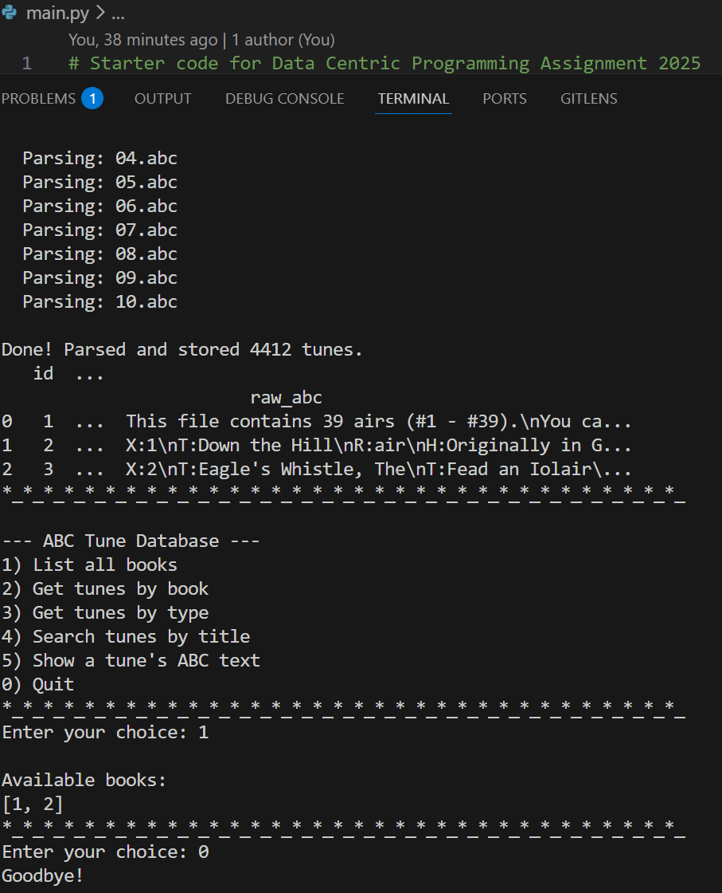
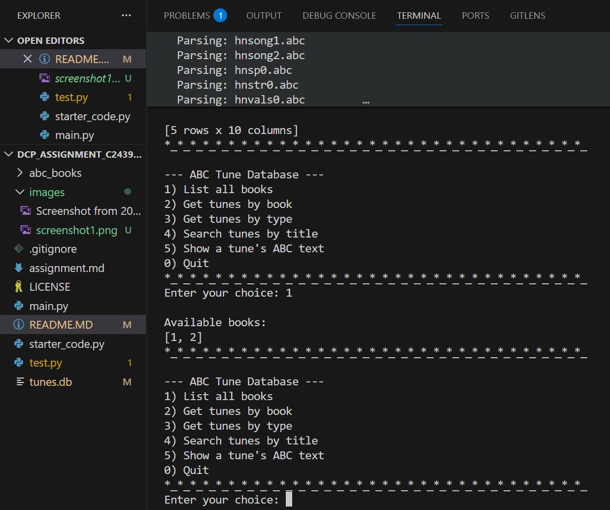
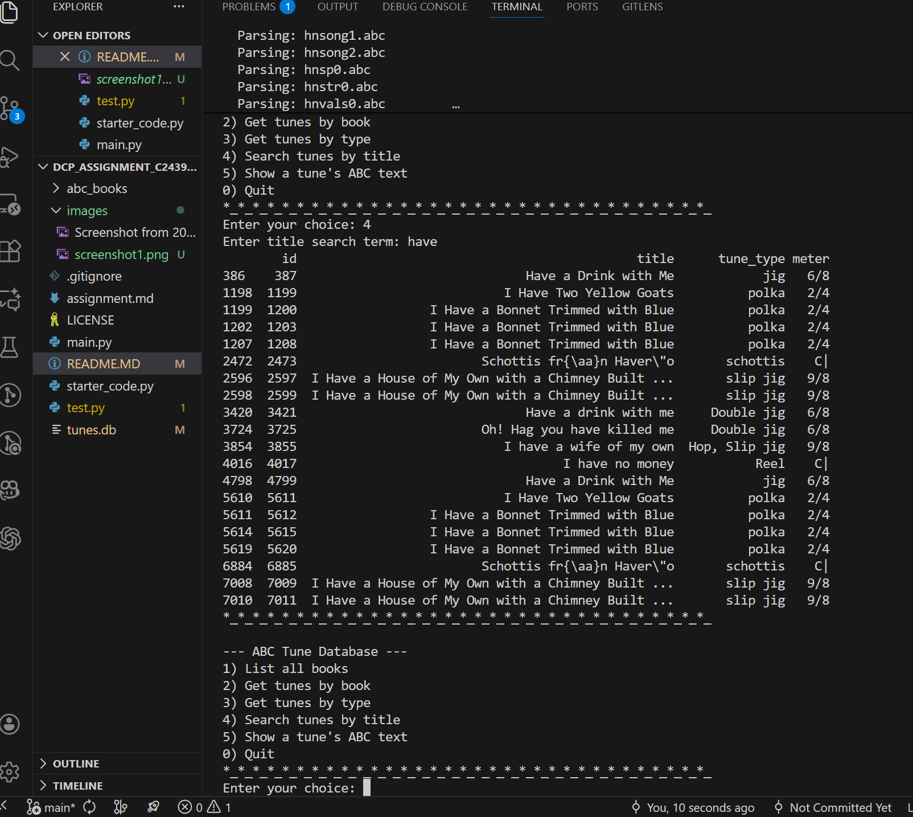
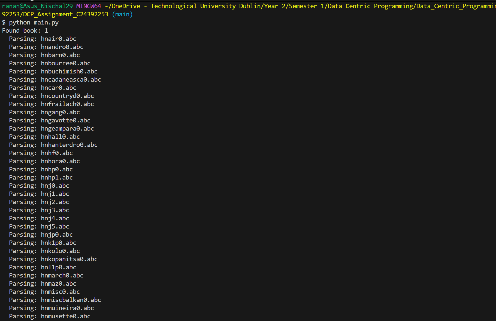
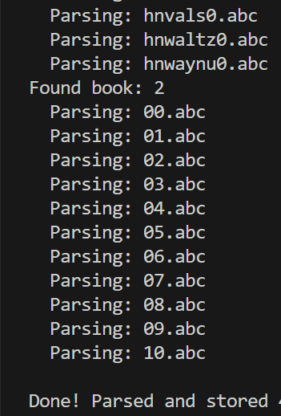

# Data Centric Programming Assignment 2025

- [Assignment Brief](assignment.md)

Name: Nischal Rana

Student Number: C24392253

# Screenshots











# Description of the project
The project is a complete data-driven program that evaluates and processes classic songs in the format of abc notation. A directory of music "books", each of which has several.abc files, is automatically scanned by the application. The program must accurately recognise and parse tune borders using ABC headers like X:, T:, R:, M:, and K: because each file may include one or more songs.

Each song is processed, then stored in a SQLite database (tunes.db) as a structured Python dictionary. All significant metadata, such as the book number, tune index, title, tune type, meter, key signature, and the complete raw ABC text, are recorded in the database structure.

The stored data is subsequently loaded and analysed using a pandas DataFrame, allowing queries like:
*Listing every song in a particular book
*Sorting music by genre (air, reel, jig, etc.)
*Title-based music search (case-insensitive)
*Seeing the complete ABC notation for any song

Additionally, the project has an interactive user interface that can be accessed as an optional Tkinter GUI or as a text-based menu. Without writing any code, these interfaces make it simple for users to browse books, find music, filter results, and display ABC notation.

# Instructions for use
Menu Options
1) List all books
	Displays all available book numbers found in the dataset.

2) Get tunes by book
	Prompts you to enter a book number (e.g., 0, 1, 2).
	The program then displays the first 20 tunes from that book, including:
		*Tune ID
		*Title
		*Tune type
		*Meter
		*Key signature

3) Get tunes by type

4) Search tunes by title

5) Show a tune’s ABC text
	Prompts you to enter a Tune ID.
	You can see Tune IDs in results from options 2–4.

0) Quits the program

# How it works:


# List of files in the project

| Files | Source |
|-----------|-----------|
| main.py | Self written |
| starter_code.py | Modified from [reference]() |
| test.py | From [reference]() |

# References
* Item 1
* Item 2

# What I am most proud of in the assignment

Bla bla bla

# What I learned

Bla bla bla


## This is how to markdown text:

This is *emphasis*

This is a bulleted list

- Item
- Item

This is a numbered list

1. Item
1. Item

This is a [hyperlink](http://bryanduggan.org)

# Headings
## Headings
#### Headings
##### Headings

This is code:

```Java
public void render()
{
	ui.noFill();
	ui.stroke(255);
	ui.rect(x, y, width, height);
	ui.textAlign(PApplet.CENTER, PApplet.CENTER);
	ui.text(text, x + width * 0.5f, y + height * 0.5f);
}
```

So is this without specifying the language:

```
public void render()
{
	ui.noFill();
	ui.stroke(255);
	ui.rect(x, y, width, height);
	ui.textAlign(PApplet.CENTER, PApplet.CENTER);
	ui.text(text, x + width * 0.5f, y + height * 0.5f);
}
```

This is an image using a relative URL:


This is an image using an absolute URL:


This is a youtube video:

[](https://www.youtube.com/watch?v=J2kHSSFA4NU)

This is a table:

| Heading 1 | Heading 2 |
|-----------|-----------|
|Some stuff | Some more stuff in this column |
|Some stuff | Some more stuff in this column |
|Some stuff | Some more stuff in this column |

|Some stuff | Some more stuff in this column |
